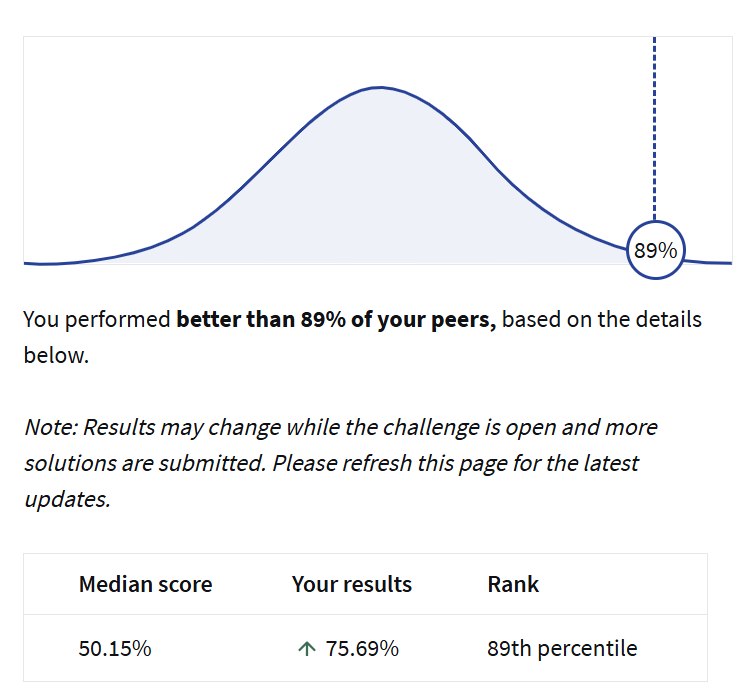

# Loan Default Prediction

This repository presents the code and detailed analysis for the **Loan Default Prediction** project, successfully completed as part of the **Coursera Data Science Coding Challenge**.

---

## Project Overview

This project tackled a crucial problem in the financial sector: **predicting loan defaults**. My objective was to develop a robust and reliable classification model using a real-world dataset. The focus was on applying a comprehensive data science workflow, including in-depth data analysis, strategic feature engineering, and rigorous experimentation with various machine learning algorithms to build a highly performant predictive model.

---

## Approach

The project followed a structured and iterative workflow:

### Data Preparation & Preprocessing

* **Exploratory Data Analysis (EDA):** I began by thoroughly analyzing data distributions, identifying key relationships between variables, and uncovering initial insights into the dataset.
* **Feature Engineering and Selection:** This critical phase involved constructing impactful new features from existing data. These were created by combining two or more existing features to capture non-linear relationships. For instance, I created:
    * **Interest Cost:** Calculated as `Loan_Amount * Interest Rate`.
    * **Stability Index:** Calculated as `Age * Employment Duration`.
* **Scaling/Normalization:** To ensure fair comparison and improve the convergence of machine learning algorithms, `StandardScaler` was applied to the numerical features.
* **Data Imbalance:** Recognizing the significant class imbalance in the target variable (roughly an 8:1 ratio of non-defaults to defaults), I applied the **SMOTE (Synthetic Minority Over-sampling Technique)** before modeling to balance the classes and prevent bias.

### Model Building & Evaluation

* **Model Selection and Evaluation:** I experimented with a diverse set of classification algorithms, including **Logistic Regression**, **Decision Trees**, **Random Forest**, **Naive Bayes**, and **XGBoost**. Each model's performance was rigorously evaluated to determine its efficacy.
* **Model Tuning:** I applied **Cross-Validation** techniques to find which model scored the optimal **ROC AUC** metric based on both test and cross-validation scores, ensuring robust and generalizable performance.
* **Final Model Choice:** Through extensive evaluation, the **XGBoost classifier** consistently demonstrated superior performance and was selected as the final model for its robustness in predicting loan defaults.

---

## Tools and Libraries Used

* **Python** (Jupyter Notebook for interactive development)
* **Pandas** (for data manipulation and analysis)
* **NumPy** (for numerical operations)
* **Scikit-Learn** (for machine learning algorithms and preprocessing)
* **XGBoost** (for high-performance gradient boosting)
* **Matplotlib & Seaborn** (for data visualization)

---

## Skills Demonstrated

This project showcases a strong command of essential data science and machine learning skills:

* **Data Analysis**
* **Feature Engineering**
* **Data Visualization**
* **Machine Learning**
* **Model Evaluation**
* **Problem-Solving in Financial Contexts**

---

## Results

The project concludes with a submission of predicted probabilities for loan defaults on a test dataset. The **ROC AUC score** obtained after submission was **0.7569** on my first trial, indicating a strong performance. This score placed my solution among the top submissions, performing better than **89% of the project submissions**. The **ROC AUC metric** effectively reflects the model's ability to distinguish between loan defaults and non-defaults, demonstrating its practical value in risk assessment.
